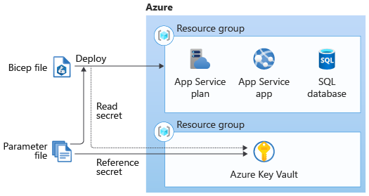

# Module 3 - Build reusable Bicep templates by using parameters

- [Module](https://learn.microsoft.com/en-us/training/modules/build-reusable-bicep-templates-parameters/)

## Notes

### Parameter types

Bicep params can be one of the following types:

- `string`: Arbitrary text values.
- `int`: Number values.
- `bool`: Boolean (true/false) values.
- `object`: Structured data & lists.
- `array`: Structured data & lists.

### Example of using a parameter

```bicep
param appServicePlanSku object = {
    name: 'F1'
    tier: 'Free'
    capacity: 1
}
```

When you reference this parameter in a template, you can select individual properties using `.dot.notation`:

```bicep
resource appServicePlan 'Microsoft.Web/serverfarms@2023-12-01' = {
  name: appServicePlanName
  location: location
  sku: {
    // Select the .name property of the appServicePlanSku parameter
    name: appServicePlanSku.name
    // Select the .tier property of the appServicePlanSku parameter
    tier: appServicePlanSku.tier
    capacity: appServicePlanSku.capacity
  }
}
```

### Example of using an object parameter to specify resource tags

You can create resource tags as params and apply them to resource templates. First, create the tag parameter:

```bicep
param resourceTags object = {
    EnvironmentName: 'Test'
    CostCenter: '100100'
    Team: 'Human Resources'
}
```

You can then re-use the `resourceTags` parameter across resource definitions in a Bicep file:

```bicep
// This is the same code as above
param resourceTags object = {
    EnvironmentName: 'Test'
    CostCenter: '100100'
    Team: 'Human Resources'
}

// Apply the resourceTags object to 2 resources, in the tags: parameter for that resource

resource appServicePlan 'Microsoft.Web/serverfarms@2023-12-01' = {
    name: appServicePlanName
    location: location
    // Uses the resourceTags module above to add the EnvironmentName, CostCenter, and Team tags to this resource
    tags: resourceTags
}

resource appServiceApp 'Microsoft.Web/sites@' = {
    name: appServiceAppName
    location: location
    tags: resourceTags
    kind: 'app'
    properties: {
        serverFarmId: appServicePlan.id
    }
}
```

### Arrays

Arrays are lists of items. Arrays can contain other types, like an array of arrays, array of objects, array of strings, etc. Note that you **cannot specify the type of individual items contained in an array**, for example you can't specify that an array must contain `string` values.

#### Array example: Cosmos DB multi-region

```bicep
param cosmosDBAccountLocations array = [
    {
        locationName: 'australiaeast'
    }
    {
        locationName: 'southcentralus'
    }
    {
        locationName: 'westeurope'
    }
]
```

When you declare a resource, like a Cosmos DB resource, you can use this `cosmosDBAccountLocations` object parameter for the database's `properties.locations`:

```bicep
resource account 'Microsoft.DocumentDB/databaseAccounts@2022-08-15' = {
    name: accountName
    location: location
    // Load the available locations from the cosmosDBAccountLocations parameter
    properties: {
        locations: cosmosDBAccountLocations
    }
}
```

### Allowed values

You can use the `@allowed([])` syntax to limit the options for values a parameter can accept:

```bicep
@allowed([
    'P1v3'
    'P2v3'
    'P3v3'
])
param appServicePlanSkuName string
```

Warning from Microsoft's documentation:

> 💡 Use the @allowed decorator sparingly. If you use this decorator too broadly, you might block valid deployments if you don't keep the list up to date. The preceding example allows for only Premium v3 SKUs in production. If you need to use the same template to deploy some cheaper non-production environments, the list of allowed values might stop you from using other SKUs that you need to use.

You can also restrict parameter length with `@minLength()` and `@maxLength()`:

```bicep
@minLength(5)
@maxLength(24)
param storageAccountName string
```

For numeric parameters, you can also specify a `@minValue()` and `@maxValue()`:

```bicep
@minValue(1)
@maxValue(10)
param appServicePlanInstanceCount int
```

### Add descriptions to parameters

You can add a description tag with the `@description()` operator:

```bicep
@description('The locations into which this Cosmos DB account should be configured. This parameter needs to be a list of objects, each of which has a locationName property.')
param cosmosDBAccountLocations array
```

### Set secure params for secrets

You can add `@secure()` to a parameter to hide these values from messages in the deployment logs:

```bicep
...

@secure()
param sqlServerAdministratorLogin string
```

Note that these secret parameters do not have a default value. It is best practice to avoid specifying default values for usernames, password, & other secrets. You should also avoid putting secrets in parameter JSON files.

Make sure you do **not** create `output`s for secret values.

The best way to manage these credentials is to use [Managed identities for Azure resources](https://learn.microsoft.com/en-us/azure/active-directory/managed-identities-azure-resources/overview) instead.

The best approach is to use Azure KeyVault. You can refer to secrets in key vaults that are located in different resource groups or subscriptions:



This is an example of a parameters JSON file that uses Key Vault to look up a SQL server administrator login/password:

```bicep
{
  "$schema": "https://schema.management.azure.com/schemas/2019-04-01/deploymentParameters.json#",
  "contentVersion": "1.0.0.0",
  "parameters": {
    "sqlServerAdministratorLogin": {
      "reference": {
        "keyVault": {
          "id": "/subscriptions/f0750bbe-ea75-4ae5-b24d-a92ca601da2c/resourceGroups/PlatformResources/providers/Microsoft.KeyVault/vaults/toysecrets"
        },
        "secretName": "sqlAdminLogin"
      }
    },
    "sqlServerAdministratorPassword": {
      "reference": {
        "keyVault": {
          "id": "/subscriptions/f0750bbe-ea75-4ae5-b24d-a92ca601da2c/resourceGroups/PlatformResources/providers/Microsoft.KeyVault/vaults/toysecrets"
        },
        "secretName": "sqlAdminLoginPassword"
      }
    }
  }
}
```

Your key vault must be configured to allow Resource Manager to access the data in the key vault during template deployments. Also, the user who deploys the template must have permission to access the key vault.

You can also integrate Key Vault into a Bicep module (the `existing` keyword indicates to Bicep that this is a resource that already exists, not one that should be created/re-deployed):

```bicep
resource keyVault 'Microsoft.KeyVault/vaults@2023-07-01' existing = {
  name: keyVaultName
}

module applicationModule 'application.bicep' = {
  name: 'application-module'
  params: {
    apiKey: keyVault.getSecret('ApiKey')
  }
}
```
