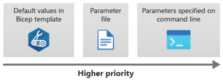

# Parameter files

You can create a `main.parameters.json` file (you can name this file anything you want) to provide params for your Bicep template, which helps with repeatability and when you have a lot of params to pass.

An example `main.parameters.json` file:

```json
{
  "$schema": "https://schema.management.azure.com/schemas/2019-04-01/deploymentParameters.json#",
  "contentVersion": "1.0.0.0",
  "parameters": {
    "appServicePlanInstanceCount": {
      "value": 3
    },
    "appServicePlanSku": {
      "value": {
        "name": "P1v3",
        "tier": "PremiumV3"
      }
    },
    "cosmosDBAccountLocations": {
      "value": [
        {
          "locationName": "australiaeast"
        },
        {
          "locationName": "southcentralus"
        },
        {
          "locationName": "westeurope"
        }
      ]
    }
  }
}
```

- `$schema` helps Azure Resource Manager to understand that this file is a parameter file.
- `contentVersion` is a property that you can use to keep track of significant changes in your parameter file if you want. Usually, it's set to its default value of 1.0.0.0.
- The `parameters` section lists each parameter and the value you want to use. The parameter value must be specified as an object. The object has a property called value that defines the actual parameter value to use.

Generally, you will keep a separate params file for each environment. You can name the files things like `main.parameters.dev.json` (for a "dev" params file), or `main.parameters.prod.json` (for a "production" params file).

To pass a params file while deploying a Bicep template, use the `--parameters` arg:

```shell
az deployment group create --template-file main.bicep --parameters main.parameters.json
```

The precedence for parameters is (lowest to highest):

- Default values in the template
- Values defined in a parameters file
- Parameters specific on the CLI



As an example, here is a parametrized Bicep `main.bicep` template file:

```bicep
param location string = resourceGroup().location
param appServicePlanInstanceCount int = 1
param appServicePlanSku object = {
  name: 'F1'
  tier: 'Free'
}
```

And the accompanying `main.parameters.json` file:

```json
{
  "$schema": "https://schema.management.azure.com/schemas/2019-04-01/deploymentParameters.json#",
  "contentVersion": "1.0.0.0",
  "parameters": {
    "appServicePlanInstanceCount": {
      "value": 3
    },
    "appServicePlanSku": {
      "value": {
        "name": "P1v3",
        "tier": "PremiumV3"
      }
    }
  }
}
```

To apply this template with the params file:

```shell
az deployment group create --template-file main.bicep --parameters main.parameters.json appServicePlanInstanceCount=5
```

To override one of the parameters from the CLI, you can set it explicitly after the parameters file, i.e. to override the JSON value for `appServicePlanInstanceCount`:

```shell
az deployment group create --template-file main.bicep --parameters main.parameters.json appServicePlanInstanceCount=5
```
